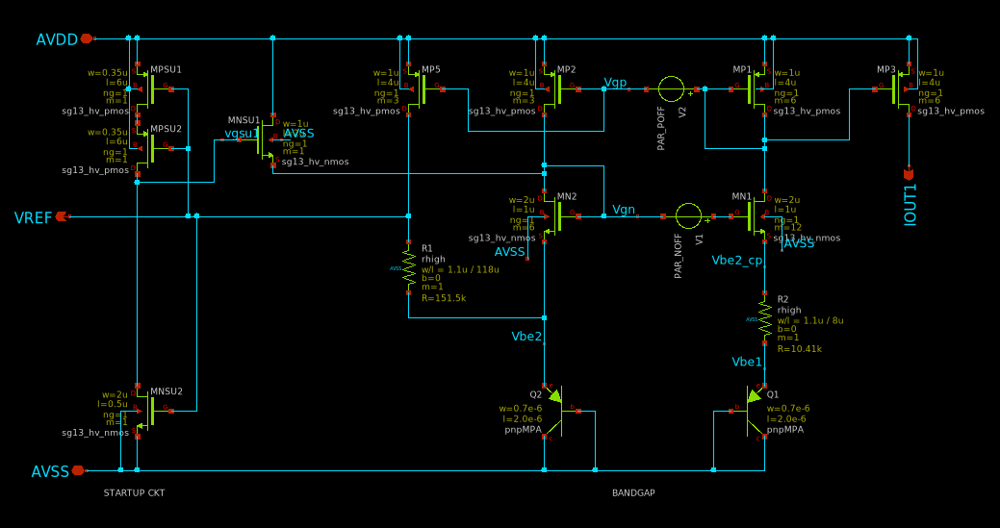

# Compact Bandgap Reference (BGR)
A compact bandgap reference (BGR) in IHP SG13CMOS5L as part of Chipalooza #2

This is a compact version of classic bandgap reference to provide designers the option of generating a bandgap voltage (1.2V) using a small area at the expense of performance. 
It is intended to fit inside an existing Pad without taking up extra area in the core. It can serve as reference for various application including LDOs, low-resolution converters, etc.

